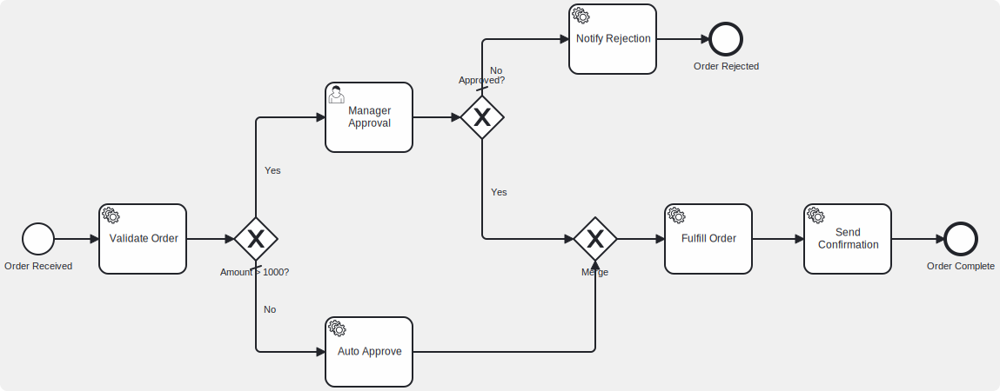

# RodarBPMN Demo: Order Processing Workflow

A reference application demonstrating how to integrate **RodarBPMN** — an Elixir BPMN 2.0 execution engine — into a Phoenix LiveView application. This demo implements a complete order processing workflow with exclusive gateways, user tasks, service task handlers, inline script tasks, and an interactive BPMN diagram viewer.

## The Workflow



**Key behaviors:**

- Orders with amount <= 1000 auto-approve via an inline script task and complete immediately
- Orders with amount > 1000 pause at a user task for manager approval
- Approved orders continue to fulfillment and confirmation
- Rejected orders take a separate path to rejection notification

## Quick Start

```bash
cd rodar_demo
mix setup
mix phx.server
```

Visit [localhost:4000](http://localhost:4000) to create, approve, and reject orders.

## How RodarBPMN Works

RodarBPMN is a token-based BPMN 2.0 execution engine. It parses standard BPMN XML, builds an in-memory process map, and executes flows by passing tokens through nodes. Each node type (start event, service task, gateway, etc.) has a handler that receives the token and decides what happens next.

### Core Concepts

| Concept                | Description                                                              |
| ---------------------- | ------------------------------------------------------------------------ |
| **Process Definition** | A parsed BPMN XML stored in the Registry, keyed by process ID            |
| **Process Instance**   | A running GenServer (`RodarBpmn.Process`) executing a definition         |
| **Context**            | A GenServer holding all mutable state: data, metadata, execution history |
| **Token**              | A struct that flows through the process graph, tracking current position |
| **Element**            | A tagged tuple `{:bpmn_type, %{id: ..., outgoing: [...], ...}}`          |

### Execution Flow

```
  BPMN XML
     |
     v
  Diagram.load/1 -----> %{processes: [{:bpmn_process, attrs, elements}]}
     |
     v
  Registry.register/2 -- stores definition by process ID
     |
     v
  Process.start_link/2 -- creates instance under ProcessSupervisor
     |
     v
  Context.put_data/3 --- populate initial data
     |
     v
  Process.activate/1 --- finds start event, creates token, begins execution
     |
     v
  RodarBpmn.execute/3 -- dispatches token to each node's handler
     |
     +---> {:ok, context}    -- process completed
     +---> {:manual, data}   -- paused at user task (status: :suspended)
     +---> {:error, reason}  -- execution failed
```

## Integration Guide

This section walks through each step of integrating RodarBPMN into your own application, using this demo as a reference.

### Step 1: Add the Dependency

```elixir
# mix.exs
defp deps do
  [
    {:rodar_bpmn, github: "rodar-project/rodar_bpmn"}
  ]
end
```

RodarBPMN starts its own supervision tree automatically (`RodarBpmn.Application`), which includes the Registry, process supervisors, event bus, and optionally a persistence adapter.

### Step 2: Configure Persistence (Optional)

If your workflow uses user tasks or any element that suspends execution, enable persistence so process state survives across suspend/resume cycles:

```elixir
# config/config.exs
config :rodar_bpmn, :persistence, adapter: RodarBpmn.Persistence.Adapter.ETS
```

The ETS adapter is suitable for development. For production, implement the `RodarBpmn.Persistence` behaviour with your own adapter (e.g., backed by a database).

### Step 3: Define Your BPMN Process

Create a standard BPMN 2.0 XML file. RodarBPMN supports all common elements:

```xml
<!-- priv/bpmn/my_process.bpmn -->
<bpmn:process id="my_process" name="My Process" isExecutable="true">
  <bpmn:startEvent id="Start_1">
    <bpmn:outgoing>Flow_1</bpmn:outgoing>
  </bpmn:startEvent>

  <bpmn:serviceTask id="Task_DoWork" name="Do Work">
    <bpmn:incoming>Flow_1</bpmn:incoming>
    <bpmn:outgoing>Flow_2</bpmn:outgoing>
  </bpmn:serviceTask>

  <bpmn:endEvent id="End_1">
    <bpmn:incoming>Flow_2</bpmn:incoming>
  </bpmn:endEvent>

  <bpmn:sequenceFlow id="Flow_1" sourceRef="Start_1" targetRef="Task_DoWork"/>
  <bpmn:sequenceFlow id="Flow_2" sourceRef="Task_DoWork" targetRef="End_1"/>
</bpmn:process>
```

#### Supported Element Types

**Events:** Start, End, Intermediate Throw/Catch, Boundary (message, signal, timer, error, escalation, conditional, compensate)

**Tasks:** Service, User, Script, Manual, Send, Receive

**Gateways:** Exclusive (XOR), Parallel (AND), Inclusive (OR), Complex, Event-based

**Subprocesses:** Embedded, Call Activity

**Flows:** Sequence flows with optional condition expressions

### Step 4: Write Service Task Handlers

Service tasks require a handler module implementing the `RodarBpmn.Activity.Task.Service.Handler` behaviour:

```elixir
defmodule MyApp.Handlers.DoWork do
  @behaviour RodarBpmn.Activity.Task.Service.Handler

  @impl true
  def execute(attrs, data) do
    # attrs: the BPMN element's attributes (id, name, etc.)
    # data:  the current process context data (all variables)

    result = perform_work(data["input"])

    # Return {:ok, map} to merge result into context data
    {:ok, %{"output" => result}}

    # Or return {:error, reason} to stop execution
    # {:error, "Something went wrong"}
  end
end
```

The handler receives two arguments:

| Argument | Type  | Description                                                              |
| -------- | ----- | ------------------------------------------------------------------------ |
| `attrs`  | `map` | The BPMN element's parsed attributes (`:id`, `:name`, `:outgoing`, etc.) |
| `data`   | `map` | All current process data (accumulated from previous tasks)               |

Return values:

| Return                 | Effect                                                         |
| ---------------------- | -------------------------------------------------------------- |
| `{:ok, %{key: value}}` | Map merged into context data, token released to outgoing flows |
| `{:ok, non_map}`       | Token released, no data merge                                  |
| `{:error, reason}`     | Execution stops with error status                              |

### Step 5: Register Handlers and Process Definition

Register your handler modules in the `TaskRegistry` by BPMN element ID, then parse and register the process definition:

```elixir
# Register handlers by task element ID
RodarBpmn.TaskRegistry.register("Task_DoWork", MyApp.Handlers.DoWork)
RodarBpmn.TaskRegistry.register("Task_Notify", MyApp.Handlers.Notify)

# Parse and register the BPMN definition
xml = File.read!("priv/bpmn/my_process.bpmn")
diagram = RodarBpmn.Engine.Diagram.load(xml)
[{:bpmn_process, _attrs, _elements} = definition] = diagram.processes
RodarBpmn.Registry.register("my_process", definition)
```

The `Service` task handler automatically resolves handlers from the `TaskRegistry` by element ID at runtime — no manual patching of parsed elements is needed.

### Step 6: Create and Run Process Instances

```elixir
# Option A: Step by step (more control)
{:ok, pid} = DynamicSupervisor.start_child(
  RodarBpmn.ProcessSupervisor,
  {RodarBpmn.Process, {"my_process", %{}}}
)

context = RodarBpmn.Process.get_context(pid)

# Set initial data
RodarBpmn.Context.put_data(context, "customer", "Alice")
RodarBpmn.Context.put_data(context, "amount", 500)

# Activate — blocks until completion or user task
RodarBpmn.Process.activate(pid)

# Check result
case RodarBpmn.Process.status(pid) do
  :completed -> IO.puts("Done!")
  :suspended -> IO.puts("Waiting for user input")
  :error     -> IO.puts("Something went wrong")
end

# Option B: One-liner (creates + activates)
{:ok, pid} = RodarBpmn.Process.create_and_run("my_process", %{"customer" => "Alice"})
```

### Step 7: Handle User Tasks

When execution hits a user task, the process suspends and returns `{:manual, task_data}`. To continue:

```elixir
# Get the context and process map
context = RodarBpmn.Process.get_context(pid)
process_map = RodarBpmn.Context.get(context, :process)

# Find the user task element by its BPMN ID
user_task = Map.get(process_map, "Task_ManagerApproval")

# Resume with user input (map is merged into context data)
result = RodarBpmn.Activity.Task.User.resume(user_task, context, %{
  "approved" => true,
  "comment" => "Looks good"
})

case result do
  {:ok, _context}  -> # Process completed
  {:manual, _data} -> # Hit another user task
  {:error, reason} -> # Something failed
end
```

### Step 8: Query Execution History

Every node visit is recorded automatically:

```elixir
context = RodarBpmn.Process.get_context(pid)

# Full execution history
history = RodarBpmn.Context.get_history(context)
# => [%{node_id: "Start_1", token_id: "abc-123", ...}, ...]

# History for a specific node
node_history = RodarBpmn.Context.get_node_history(context, "Task_Validate")

# All process data
data = RodarBpmn.Context.get(context, :data)
# => %{"customer" => "Alice", "validated" => true, "fulfilled" => true, ...}
```

## Condition Expressions

Sequence flows leaving exclusive gateways can have condition expressions. RodarBPMN supports two expression languages:

### Elixir (Sandboxed)

The default. Expressions are parsed and evaluated against an AST allowlist — no arbitrary code execution:

```xml
<bpmn:conditionExpression>data["amount"] > 1000</bpmn:conditionExpression>
```

Available in expressions:

- Data access: `data["key"]`, `data[:key]`
- Comparisons: `==`, `!=`, `>`, `<`, `>=`, `<=`
- Boolean: `and`, `or`, `not`
- Arithmetic: `+`, `-`, `*`, `/`
- String ops: `<>` (concatenation)
- Collections: `Enum.member?/2`, `length/1`, `hd/1`, `tl/1`
- Control: `if/else`, `case`, `cond`
- Pipes: `|>`

### FEEL (Friendly Enough Expression Language)

The standard BPMN expression language. Bindings receive the data map directly — no `data["..."]` prefix:

```xml
<bpmn:conditionExpression xsi:type="bpmn:tFormalExpression"
  language="feel">amount > 1000</bpmn:conditionExpression>
```

FEEL features: null propagation, three-valued boolean logic, `if-then-else`, `in` operator (list/range), built-in functions (`abs`, `floor`, `contains`, `string length`, etc.).

## Advanced Features

### Exclusive Gateway with Default Flow

Set `default="flow_id"` on the gateway element. If no condition matches, the default flow is taken:

```xml
<bpmn:exclusiveGateway id="GW_1" default="Flow_Default">
  <bpmn:outgoing>Flow_A</bpmn:outgoing>
  <bpmn:outgoing>Flow_Default</bpmn:outgoing>
</bpmn:exclusiveGateway>

<bpmn:sequenceFlow id="Flow_A" sourceRef="GW_1" targetRef="Task_A">
  <bpmn:conditionExpression>data["choice"] == "A"</bpmn:conditionExpression>
</bpmn:sequenceFlow>

<!-- No condition = default path -->
<bpmn:sequenceFlow id="Flow_Default" sourceRef="GW_1" targetRef="Task_Default"/>
```

### Parallel Gateway (Fork/Join)

Fork to all outgoing paths simultaneously, then wait for all to complete before continuing:

```xml
<bpmn:parallelGateway id="Fork_1">
  <bpmn:outgoing>Flow_A</bpmn:outgoing>
  <bpmn:outgoing>Flow_B</bpmn:outgoing>
</bpmn:parallelGateway>

<!-- Both Task_A and Task_B execute -->

<bpmn:parallelGateway id="Join_1">
  <bpmn:incoming>Flow_A_Done</bpmn:incoming>
  <bpmn:incoming>Flow_B_Done</bpmn:incoming>
  <bpmn:outgoing>Flow_Continue</bpmn:outgoing>
</bpmn:parallelGateway>
```

### Script Tasks

Execute inline scripts (Elixir or FEEL) without a handler module. The script result is stored in the context under the task's `:output_variable` (defaults to `:script_result`).

This demo uses a script task for `Task_AutoApprove` — it evaluates `true` and stores the result as `"approved"` in the process data:

```xml
<bpmn:scriptTask id="Task_AutoApprove" name="Auto Approve" scriptFormat="elixir">
  <bpmn:script>true</bpmn:script>
</bpmn:scriptTask>
```

Script tasks can also perform computations using process data:

```xml
<bpmn:scriptTask id="Task_Calculate" name="Calculate Total"
  scriptFormat="elixir">
  <bpmn:script>data["quantity"] * data["price"]</bpmn:script>
</bpmn:scriptTask>
```

### Timer Events

ISO 8601 duration-based timers for intermediate catch events and boundary events:

```xml
<bpmn:intermediateCatchEvent id="Timer_Wait">
  <bpmn:timerEventDefinition>
    <bpmn:timeDuration>PT30S</bpmn:timeDuration>  <!-- 30 seconds -->
  </bpmn:timerEventDefinition>
</bpmn:intermediateCatchEvent>
```

Supports durations (`PT1H30M`), cycles (`R3/PT10S` — repeat 3 times every 10s), and dates.

### Event Bus (Message/Signal)

Inter-process communication via publish/subscribe:

```elixir
# Subscribe (typically done by catch events automatically)
RodarBpmn.Event.Bus.subscribe(:message, "order_shipped", %{
  context: context,
  correlation: %{key: "order_id", value: "ORD-123"}
})

# Publish (typically done by throw events)
RodarBpmn.Event.Bus.publish(:signal, "system_shutdown", %{reason: "maintenance"})
```

### Process Validation

Validate process structure before execution:

```elixir
case RodarBpmn.Validation.validate(process_map) do
  {:ok, _}       -> # Valid
  {:error, issues} -> # List of structural issues
end

# Or raise on invalid
RodarBpmn.Validation.validate!(process_map)
```

Checks: start/end event presence, sequence flow reference integrity, orphan nodes, gateway outgoing requirements, exclusive gateway defaults, boundary event attachment.

### Versioned Definitions

The Registry supports multiple versions of each process definition:

```elixir
# Register (auto-increments version)
RodarBpmn.Registry.register("my_process", definition)

# Register with explicit version
{:ok, 5} = RodarBpmn.Registry.register("my_process", definition, version: 5)

# Lookup latest
{:ok, definition} = RodarBpmn.Registry.lookup("my_process")

# Lookup specific version
{:ok, definition} = RodarBpmn.Registry.lookup("my_process", 3)

# List versions
RodarBpmn.Registry.versions("my_process")
# => [%{version: 1, deprecated: false}, %{version: 2, deprecated: false}]

# Deprecate old version
RodarBpmn.Registry.deprecate("my_process", 1)
```

### Process Migration

Migrate running instances to a new definition version:

```elixir
# Check compatibility first
case RodarBpmn.Migration.check_compatibility(pid, new_definition) do
  :ok -> RodarBpmn.Migration.migrate(pid, new_definition)
  {:error, reasons} -> IO.inspect(reasons)
end

# Force migration (skip compatibility check)
RodarBpmn.Migration.migrate(pid, new_definition, force: true)
```

### Persistence (Dehydrate/Rehydrate)

Save and restore process state for long-running workflows:

```elixir
# Save current state
{:ok, instance_id} = RodarBpmn.Process.dehydrate(pid)

# Later, restore from saved state
{:ok, new_pid} = RodarBpmn.Process.rehydrate(instance_id)
```

Implement the `RodarBpmn.Persistence` behaviour for custom storage:

```elixir
defmodule MyApp.BpmnPersistence do
  @behaviour RodarBpmn.Persistence

  @impl true
  def save(instance_id, snapshot), do: # store to database
  @impl true
  def load(instance_id), do: # fetch from database
  @impl true
  def delete(instance_id), do: # remove from database
  @impl true
  def list(), do: # list all instance IDs
end
```

```elixir
# config/config.exs
config :rodar_bpmn, :persistence, adapter: MyApp.BpmnPersistence
```

### Hooks (Observational)

Register callbacks for execution events:

```elixir
context = RodarBpmn.Process.get_context(pid)

RodarBpmn.Hooks.register(context, :before_node, fn info ->
  IO.puts("Entering node: #{info.node_id}")
end)

RodarBpmn.Hooks.register(context, :after_node, fn info ->
  IO.puts("Completed node: #{info.node_id}")
end)

RodarBpmn.Hooks.register(context, :on_error, fn info ->
  Logger.error("Error at #{info.node_id}: #{inspect(info.error)}")
end)

RodarBpmn.Hooks.register(context, :on_complete, fn info ->
  IO.puts("Process completed!")
end)
```

Hooks are observational only — exceptions are caught and do not affect execution.

### Observability

Query running instances and system health:

```elixir
# All running instances
RodarBpmn.Observability.running_instances()
# => [%{pid: #PID<...>, instance_id: "abc", status: :running, process_id: "my_process", ...}]

# Suspended instances (waiting for user input)
RodarBpmn.Observability.waiting_instances()

# Filter by process ID and version
RodarBpmn.Observability.instances_by_version("my_process", 2)

# Execution history for an instance
RodarBpmn.Observability.execution_history(pid)

# System health check
RodarBpmn.Observability.health()
# => %{process_supervisor: ..., context_supervisor: ..., registry: ..., ...}
```

### Custom Task Handlers

Register handlers for service tasks by element ID. The `Service` module automatically resolves them from the `TaskRegistry` at runtime:

```elixir
defmodule MyApp.Handlers.CheckInventory do
  @behaviour RodarBpmn.Activity.Task.Service.Handler

  @impl true
  def execute(_attrs, data) do
    {:ok, %{"in_stock" => data["quantity"] > 0}}
  end
end

# Register by element ID — resolved automatically by service tasks
RodarBpmn.TaskRegistry.register("Task_CheckInventory", MyApp.Handlers.CheckInventory)
```

For non-service task types (or fully custom element types), implement the lower-level `RodarBpmn.TaskHandler` behaviour:

```elixir
defmodule MyApp.CustomHandler do
  @behaviour RodarBpmn.TaskHandler

  @impl true
  def token_in(element, context) do
    # Custom logic
    RodarBpmn.release_token(element |> elem(1) |> Map.get(:outgoing), context)
  end
end

# Register by element type (fallback for all tasks of this type)
RodarBpmn.TaskRegistry.register(:bpmn_activity_task_business_rule, MyApp.CustomHandler)
```

### Multi-Participant Collaboration

Orchestrate multiple processes communicating via message flows:

```elixir
diagram = RodarBpmn.Engine.Diagram.load(xml_with_collaboration)

{:ok, %{collaboration_id: id, instances: instances}} =
  RodarBpmn.Collaboration.start(diagram, %{})

# All participant processes are created and activated
# Message flows are wired via the Event Bus

# Stop all instances
RodarBpmn.Collaboration.stop(%{instances: instances})
```

## Project Structure

```
rodar_demo/
  priv/bpmn/
    order_processing.bpmn              # BPMN 2.0 XML (service tasks, script task, user task)
  lib/rodar_demo/
    application.ex                     # Supervision tree (includes Workflow.Manager)
    workflow/
      manager.ex                       # GenServer: parses BPMN, registers handlers, manages orders
      handlers/
        validate_order.ex              # Validates customer + amount > 0
        fulfill_order.ex               # Generates fulfillment ID
        send_confirmation.ex           # Marks confirmation sent
        notify_rejection.ex            # Records rejection
  lib/rodar_demo_web/
    router.ex                          # LiveView routes
    live/order_live/
      index.ex + index.html.heex       # Order list, create modal, approve/reject
      show.ex + show.html.heex         # Order detail, BPMN diagram, execution history
  assets/
    js/bpmn_viewer_hook.js             # bpmn-js LiveView hook with node highlighting
    css/app.css                        # BPMN viewer styles (visited/active markers)
```

Note: Auto-approval logic is embedded directly in the BPMN file as an inline Elixir script task, rather than using a separate handler module.

## Supervision Tree

RodarBPMN starts its own supervision tree automatically. Your application only needs to register process definitions and create instances:

```
RodarBpmn.Application
  |-- RodarBpmn.ProcessRegistry      (Elixir Registry, :unique)
  |-- RodarBpmn.EventRegistry        (Elixir Registry, :duplicate)
  |-- RodarBpmn.Registry             (versioned process definitions)
  |-- RodarBpmn.TaskRegistry          (custom task handler registrations)
  |-- RodarBpmn.ContextSupervisor    (DynamicSupervisor for contexts)
  |-- RodarBpmn.ProcessSupervisor    (DynamicSupervisor for instances)
  |-- RodarBpmn.Event.Start.Trigger  (auto-start on signal/message events)
  +-- Persistence Adapter            (if configured)
```

## Running Tests

```bash
mix test
```

## Learn More

- [Phoenix Framework](https://www.phoenixframework.org/)
- [Phoenix LiveView](https://hexdocs.pm/phoenix_live_view)
- [BPMN 2.0 Specification](https://www.omg.org/spec/BPMN/2.0/)
- [bpmn-js](https://bpmn.io/toolkit/bpmn-js/) — BPMN diagram viewer used in this demo
